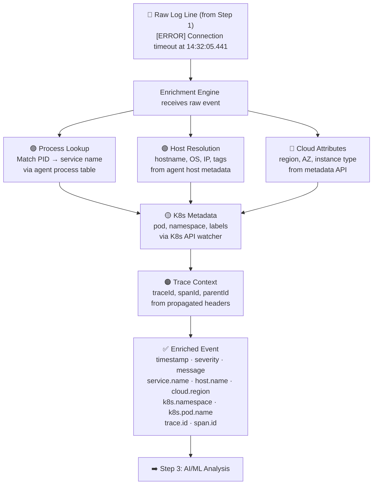
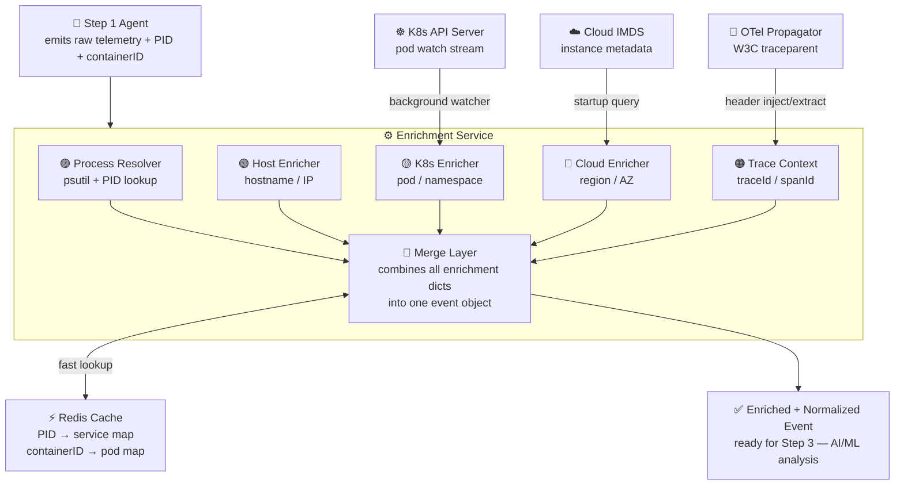
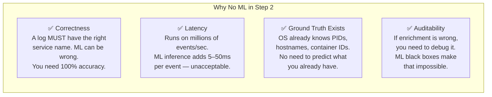
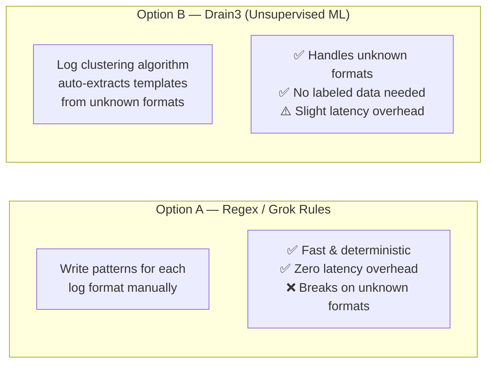
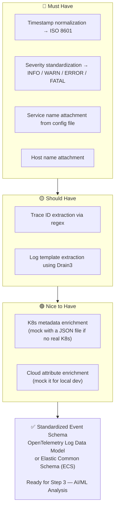

## Step 2: Data Enrichment & Preprocessing

> ⚠️ **No AI or ML is used in this step.** Everything here is deterministic, rule-based processing.

---

### The Core Problem This Step Solves

When the Step 1 collector grabs a raw log line, it looks something like this:

```
[ERROR] Connection timeout at 14:32:05.441
```

That's useless on its own. You don't know *which* service threw it, *which* server it came from, *which* Kubernetes pod it ran in, or *which* user transaction it belonged to.

**Data enrichment is the process of automatically attaching that missing context to every single log, metric, and trace — before any analysis happens.**

---

### What Dynatrace Actually Does (The Real Mechanism)

Dynatrace enriches data through four parallel enrichment engines running simultaneously:

#### 1. Topology-Based Enrichment (SmartScape)
Dynatrace builds a real-time topology map of your entire infrastructure — every service, host, process, and their relationships. When a log comes in, it gets stamped with its position in this topology map.

How it works under the hood: The OneAgent continuously reports process metadata (PID, process name, listening ports) back to the Dynatrace server. The server matches incoming telemetry to known processes using port numbers, process group IDs, and namespace identifiers.

#### 2. Context Propagation via Instrumentation (Distributed Tracing)
Dynatrace injects a trace context header (`x-dynatrace`) into every HTTP/gRPC request automatically. This header carries a `traceId` and `spanId`. When that request generates a log or metric downstream, the agent reads this header from the active request context and stamps it onto the telemetry.

This is how a log line in `database-service` gets linked to a user's checkout transaction that started in `frontend-service`. It's not magic — it's header injection + context propagation.

#### 3. Kubernetes Metadata Enrichment (K8s API Watcher)
Dynatrace runs a Kubernetes operator that watches the K8s API server continuously, polling for pod metadata (namespace, deployment name, labels, node name). When telemetry comes from a container, the agent maps the container's cgroup ID to a pod via the K8s API watcher and attaches the pod's full metadata.

#### 4. Cloud Provider Attribute Enrichment
On cloud VMs (AWS EC2, GCP, Azure), the OneAgent queries the instance metadata service at startup (e.g., `http://169.254.169.254/latest/meta-data/` on AWS). It reads region, availability zone, instance type, and account ID — and stamps all of this onto every piece of telemetry from that host.

---

### The Complete Enrichment Flow

How a single raw log line gets transformed step by step:



**Before enrichment:**
```
[ERROR] Connection timeout at 14:32:05.441
```

**After enrichment:**
```json
{
  "timestamp": "2026-06-23T14:32:05.441Z",
  "severity": "ERROR",
  "message": "Connection timeout",
  "service.name": "payment-service",
  "host.name": "prod-node-07",
  "cloud.region": "ap-south-1",
  "k8s.namespace": "production",
  "k8s.pod.name": "payment-7f8c9d-xk2p",
  "trace.id": "a1b2c3d4e5f6",
  "span.id": "9f8e7d6c"
}
```

---

### How To Build This Yourself

#### Requirements

**Infrastructure:**
- A collector agent running on each host (built in Step 1)
- Access to the Kubernetes API (if using K8s)
- Access to cloud metadata endpoints (if on cloud)
- A central enrichment service that receives raw telemetry

**Tech Stack:**
- Python with `psutil` for process info (or Go)
- Redis for caching enrichment lookups — critical for performance; you never want to hit the K8s API on every single log line
- OpenTelemetry SDK for trace context propagation (optional but highly recommended)

---

#### Enrichment Service Architecture



---

### The 5 Enrichment Modules

#### Module 1: Process & Service Resolver

Maintains a process registry — a background thread running every 5 seconds that scans all running processes and caches `PID → {service_name, ports}`:

```python
import psutil, redis

cache = redis.Redis()

def refresh_process_registry():
    for proc in psutil.process_iter(['pid', 'name', 'connections']):
        cache.hset(f"proc:{proc.info['pid']}", mapping={
            "service_name": proc.info['name'],
            "ports": str([c.laddr.port for c in proc.info['connections'] or []])
        })
```

When a log arrives with a PID, a fast Redis lookup resolves the service — no scanning at enrichment time.

---

#### Module 2: Host Metadata Enricher

Runs once at agent startup and caches host info:

```python
import socket, platform

def get_host_metadata():
    return {
        "host.name": socket.gethostname(),
        "host.ip": socket.gethostbyname(socket.gethostname()),
        "host.os": platform.system(),
        "host.arch": platform.machine()
    }
```

---

#### Module 3: Cloud Metadata Enricher

On AWS/GCP/Azure, query the Instance Metadata Service (IMDS) at agent startup:

```python
import requests

def get_aws_metadata():
    try:
        token = requests.put(
            "http://169.254.169.254/latest/api/token",
            headers={"X-aws-ec2-metadata-token-ttl-seconds": "60"}
        ).text
        headers = {"X-aws-ec2-metadata-token": token}
        return {
            "cloud.provider": "aws",
            "cloud.region": requests.get(
                "http://169.254.169.254/latest/meta-data/placement/region",
                headers=headers
            ).text,
            "cloud.instance_id": requests.get(
                "http://169.254.169.254/latest/meta-data/instance-id",
                headers=headers
            ).text
        }
    except:
        return {}   # not on cloud — skip gracefully
```

---

#### Module 4: Kubernetes Metadata Enricher

The most complex module. Uses the Kubernetes Python client to watch for pod events and keep a local cache of `containerID → pod metadata`:

```python
from kubernetes import client, watch

k8s_cache = {}  # containerID -> pod metadata

def watch_pods():
    v1 = client.CoreV1Api()
    w = watch.Watch()
    for event in w.stream(v1.list_pod_for_all_namespaces):
        pod = event['object']
        for cs in (pod.status.container_statuses or []):
            if cs.container_id:
                container_id = cs.container_id.replace("containerd://", "")
                k8s_cache[container_id] = {
                    "k8s.pod.name":  pod.metadata.name,
                    "k8s.namespace": pod.metadata.namespace,
                    "k8s.node.name": pod.spec.node_name,
                    "k8s.labels":    pod.metadata.labels
                }
```

The agent reads its own container ID from `/proc/self/cgroup` and looks it up in this cache.

---

#### Module 5: Trace Context Propagator

The most impactful module. Uses OpenTelemetry (the same standard Dynatrace contributed to) to inject and extract trace headers on every HTTP call:

```python
from opentelemetry.propagate import inject, extract

# On every outgoing HTTP request — inject headers
headers = {}
inject(headers)
# headers now contains:
# traceparent: 00-4bf92f3577b34da6a3ce929d0e0e4736-00f067aa0ba902b7-01
#                   └── trace ID (128-bit) ──────────────┘ └── span ID ─┘

# On every incoming request — extract context
context = extract(request.headers)
# Every log written during this request now automatically
# carries the trace context
```

---

### Is AI/ML Used in This Step?

**No — and intentionally so.**

This step is pure deterministic, rule-based processing. Here's exactly why:



> The enrichments here are all **lookups, not predictions.** You are resolving facts, not inferring patterns. That is the fundamental distinction.

---

### The One Exception: Log Parsing (Optional ML)

There is one preprocessing sub-task where ML becomes a valid option — **parsing unstructured log messages into structured fields**.

**The problem:**
```
User 'alice' logged in from 192.168.1.4 after 3 failed attempts
```
needs to become:
```json
{
  "user": "alice",
  "action": "login",
  "ip": "192.168.1.4",
  "failed_attempts": 3
}
```



**Using Drain3 in practice:**

```python
from drain3 import TemplateMiner

miner = TemplateMiner()
result = miner.add_log_message(
    "User alice logged in from 192.168.1.4 after 3 attempts"
)
# Template: "User <*> logged in from <*> after <*> attempts"
# Parameters extracted: ['alice', '192.168.1.4', '3']
```

| Approach | Learning Type | Labeled Data Needed? |
|---|---|---|
| Drain3 log parsing | Unsupervised | ❌ No |
| Severity classification | Supervised | ✅ Yes |
| All other enrichment | Rule-based | ❌ No |

---

### Implementation Priority



> **Why the output schema matters:** Step 3's anomaly detection and AI models need consistent input shapes. Without a standardized schema, your ML models can't correlate a database error with the checkout service that caused it. This enrichment step is the connective tissue of the entire system.

---

### Output Schema (Target Format)

Every event exiting Step 2 should conform to this structure:

```json
{
  "timestamp":       "2026-06-23T14:32:05.441Z",
  "severity":        "ERROR",
  "message":         "Connection timeout",
  "service.name":    "payment-service",
  "service.version": "2.1.4",
  "host.name":       "prod-node-07",
  "host.ip":         "10.0.1.47",
  "host.os":         "Linux",
  "cloud.provider":  "aws",
  "cloud.region":    "ap-south-1",
  "cloud.az":        "ap-south-1a",
  "k8s.namespace":   "production",
  "k8s.pod.name":    "payment-7f8c9d-xk2p",
  "k8s.node.name":   "gke-prod-pool-07",
  "trace.id":        "a1b2c3d4e5f67890a1b2c3d4e5f67890",
  "span.id":         "9f8e7d6c5b4a3f2e",
  "log.template":    "Connection <*> at <*>"
}
```

---

*Step 2 complete → [Step 3: Anomaly Detection & AI Analysis](#)*