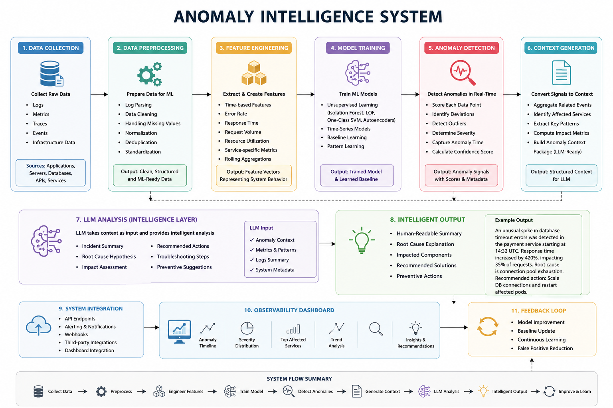

# Execution Plan: Dynatrace-Inspired Log Analytics & Anomaly Intelligence System

## Phase 1: Data Understanding & Research - already done 

Completed:

* Studied Dynatrace architecture
* Understood telemetry collection pipelines
* Explored log analytics workflows
* Researched anomaly detection approaches
* Investigated Davis AI and root cause analysis concepts
* Built research documentation and observability knowledge base

Goal:
Develop a strong understanding of how enterprise observability platforms transform raw telemetry into actionable insights.

---

## Phase 2: Data Engineering & Preprocessing - to do 

Objective:
Transform raw logs into structured machine-learning-ready data.

Steps:

1. Log Parsing

   * Extract timestamps
   * Extract log levels (INFO, WARN, ERROR, CRITICAL)
   * Extract service names
   * Extract response times
   * Extract status codes
   * Extract message patterns

2. Feature Engineering

   * Error frequency
   * Request volume
   * Failure rate
   * Response time statistics
   * Time-window aggregations
   * Service-level metrics

3. Data Cleaning

   * Handle missing values
   * Remove duplicate records
   * Normalize timestamps
   * Standardize log formats

Output:
Structured feature vectors representing system behavior over time.

---

## Phase 3: Baseline Learning - to do 

Objective:
Teach the model what "normal" system behavior looks like.

Approach:

* Historical log analysis
* Statistical profiling
* Behavioral pattern learning
* Time-series trend analysis

The system learns:

* Normal request rates
* Normal response times
* Expected error frequencies
* Seasonal patterns
* Traffic fluctuations

Output:
Dynamic baseline representing healthy system behavior.

---

## Phase 4: Anomaly Detection Engine - to do 

Objective:
Detect unusual system behavior automatically.

Potential Models:

* Isolation Forest
* Local Outlier Factor (LOF)
* One-Class SVM
* Autoencoders
* Statistical Z-Score Detection

Output:

For every anomaly:

* Anomaly score
* Severity score
* Timestamp
* Affected service
* Confidence level
* Outlier range
* Behavioral deviation metrics

---

## Phase 5: Context Generation Layer - to do 

Objective:
Convert anomaly signals into LLM-friendly context.

Instead of sending raw logs to the LLM, generate structured intelligence.

Example Output:

{
"anomaly_detected": true,
"service": "payment-service",
"anomaly_time": "2026-06-24 14:32:11",
"severity": "High",
"error_rate_increase": "420%",
"response_time_change": "+1.8 seconds",
"affected_hosts": 4,
"root_log_patterns": [
"Database timeout",
"Connection pool exhausted"
]
}

Output:
Compact anomaly intelligence package.

---

## Phase 6: LLM-Powered Incident Analysis - to do 

Objective:
Use the anomaly intelligence package as input to an LLM.

The LLM performs:

1. Incident Summary
2. Root Cause Hypothesis
3. Impact Assessment
4. Recommended Actions
5. Troubleshooting Steps
6. Executive-Level Explanation

Example:

"An unusual spike in database timeout errors was detected in the payment service beginning at 14:32 UTC. Response times increased by 420%, impacting approximately 35% of incoming requests. The most probable cause is exhaustion of database connections under elevated traffic load."

---

## Phase 7: Future Davis AI-Inspired Extensions

Future capabilities:

* Event Correlation
* Service Dependency Graphs
* Root Cause Ranking
* Causal Analysis
* Predictive Failure Detection
* Automated Incident Resolution Suggestions
* Multi-Service Topology Awareness

Goal:
Evolve from anomaly detection into an intelligent observability platform inspired by Dynatrace Davis AI.

